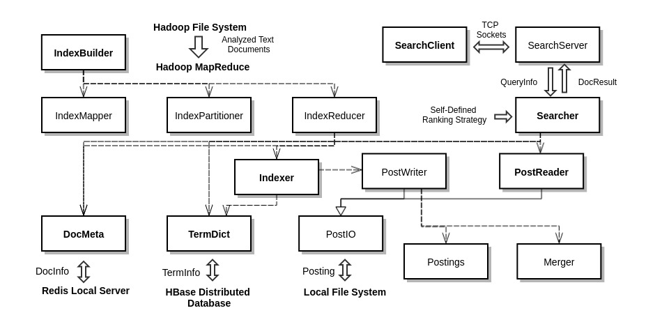
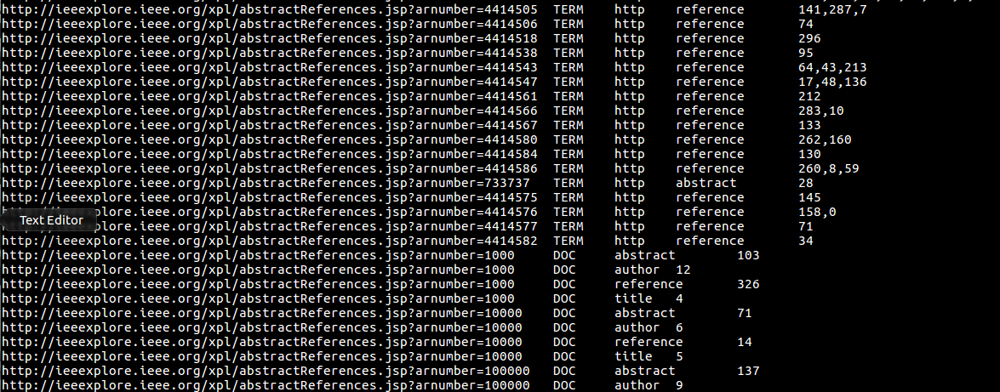

# Distributed Inverted Index Creation Module

A Distributed Inverted Index Creation Module for an academic text search engine, 
which adopts the idea of [Geometrical Partitioning by Lester et al.](http://dl.acm.org/citation.cfm?id=1099739) 
(see [my demo](doc/partition.gif))
and takes advantage of _Apache Hadoop_, _Apache HBase_ and _Redis_.

## Big Picture

Index creation in the engineering of a text search engine:

The following picture exhibits the structure of this index creation module:

(1) Package _cn.edu.sjtu.devinz.mapred_ launches a Hadoop MapReduce job to take in text analysis data and distribute them to multiple index servers.

(2) Package _cn.edu.sjtu.devinz.indexer_ manages the local index creation process on a single index server, where the local inverted files, the document info in Redis database, and the vocabulary in an HBase table would be updated incrementally.

(3) Package _cn.edu.sjtu.devinz.searcher_ implements a naive client-server system which could execute distributed ranked queries and return up to 20 results.

## Run the Tests

The distributed indexing module is designed to work on a Hadoop cluster in the laboratory of IIOT, SJTU.
At the time we launched the first round of index creation tests, the cluster only comprised one master node and two slave nodes, all of which possess 32 Intel(R) Xeon(R) CPU E5-2630 v3 @ 2.40GHz processors.
All the tests were run in Java Runtime Environment 1.8.0 and Hadoop Platform 2.5.1, along with HBase 1.4.1.
Text analysis data is stored in the HDFS directory _/TT/_, where each line contains a piece of info about a text document, just like the following picture.

To create indexes, one should guarantee the host name of each index server is stored as a single line in _/etc/hostname_, 
and that the directory _/home/hadoop/.devin/_ exists and contains two subdirectories named "index" and "logs".
Local Redis server should be in place with DB 5 available, 
and an HBase table named "TermDict" should have been built with the following schema, 
where "DOC", "title", "author", "abstract" and "reference" are necessary column families.

You can compress the binary code and all the necessary library files (HBase and Jedis) into one Jar file, 
and start the MapReduce job with a command as follow.

	hadoop jar Indexer.jar  cn.edu.sjtu.devinz.mapred.IndexBuilder 2> logs/mapred.log

Since index construction is time-consuming, running the program in background is strongly recommended.
You can open _logs/mapred.log_ on a regular basis to check the status of the MapReduce job.

Our index creation test turned out to collect [3402936 documents](doc/doc_meta.md), [4524622 terms](doc/term_dict.md) 
and [6.5GB inverted files](doc/inv_files.md).

To test the indexes you have built, you should first copy the Jar file from master to all slave nodes 
so that the programs could be run on each index server.
Then run the following command on each slave node to start all search servers.

	java -classpath Indexer.jar:${HADOOP_CLASSPATH} cn.edu.sjtu.devinz.searcher.SearchServer

After doing that, you can start a search client on the master node with the following command.

	java -classpath Indexer.jar:${HADOOP_CLASSPATH}  cn.edu.sjtu.devinz.searcher.SearchClient

Then an interpreter will get your query line by line and return up to 20 results for each query.
A sample query result could be seen [here](doc/query_test.md).

## Some Limits

(1) The interface between text analysis module and index creation module has not been wisely designed.
Text analysis data must be uploaded to HDFS before index construction, which constitutes a waste of disk storage.

(2) By adopting geometrical partitioning, we have increased the efficiency of index construction 
at the expense of worse time performance of query execution,
 due to the more disk seek operations caused by the fragmentation of posting lists.
Also, more disk storage is allocated but turns out to be idle, which is the cost of fast index updates.

(3) The distributed vocabulary is stored in HBase instead of in-memory databases, which can compromise time performance of both index construction and query execution.
At least, some caching strategies should be exploited to improve the situation.

(4) As regards phrase queries, skipping approach has not been supported by the current design, and shall be considered in the future.

