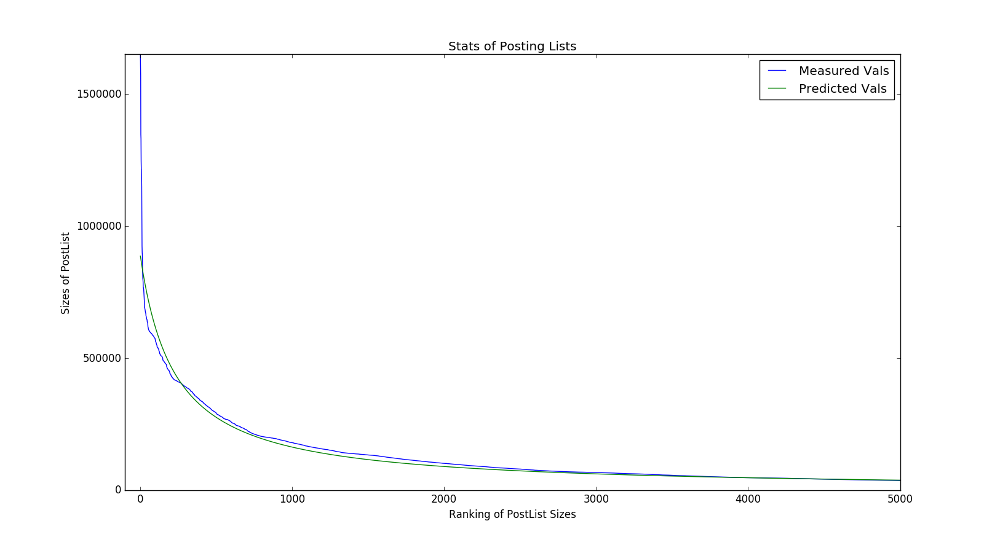

# Index Construction based on Small Document Set (478382193 bytes)

## MapReduce Console:

	MapReduce starts.
	16/05/16 00:09:50 INFO client.RMProxy: Connecting to ResourceManager at master/192.168.1.140:8032
	16/05/16 00:09:50 WARN mapreduce.JobSubmitter: Hadoop command-line option parsing not performed. Implement the Tool interface and execute your application with ToolRunner to remedy this.
	16/05/16 00:09:57 INFO input.FileInputFormat: Total input paths to process : 1
	16/05/16 00:09:57 INFO mapreduce.JobSubmitter: number of splits:2
	16/05/16 00:09:57 INFO mapreduce.JobSubmitter: Submitting tokens for job: job_1463211172532_0003
	16/05/16 00:09:58 INFO impl.YarnClientImpl: Submitted application application_1463211172532_0003
	16/05/16 00:09:58 INFO mapreduce.Job: The url to track the job: http://master:8088/proxy/application_1463211172532_0003/
	16/05/16 00:09:58 INFO mapreduce.Job: Running job: job_1463211172532_0003
	16/05/16 00:10:06 INFO mapreduce.Job: Job job_1463211172532_0003 running in uber mode : false
	16/05/16 00:10:06 INFO mapreduce.Job:  map 0% reduce 0%
	16/05/16 00:10:16 INFO mapreduce.Job:  map 16% reduce 0%
	16/05/16 00:10:17 INFO mapreduce.Job:  map 28% reduce 0%
	16/05/16 00:10:19 INFO mapreduce.Job:  map 41% reduce 0%
	16/05/16 00:10:20 INFO mapreduce.Job:  map 46% reduce 0%
	16/05/16 00:10:23 INFO mapreduce.Job:  map 61% reduce 0%
	16/05/16 00:10:26 INFO mapreduce.Job:  map 83% reduce 0%
	16/05/16 00:10:29 INFO mapreduce.Job:  map 87% reduce 0%
	16/05/16 00:10:32 INFO mapreduce.Job:  map 94% reduce 0%
	16/05/16 00:10:34 INFO mapreduce.Job:  map 100% reduce 0%
	16/05/16 00:11:04 INFO mapreduce.Job:  map 100% reduce 17%
	16/05/16 00:11:43 INFO mapreduce.Job:  map 100% reduce 67%
	16/05/16 00:19:36 INFO mapreduce.Job:  map 100% reduce 68%
	16/05/16 00:29:54 INFO mapreduce.Job:  map 100% reduce 69%
	16/05/16 00:40:17 INFO mapreduce.Job:  map 100% reduce 70%
	16/05/16 00:50:48 INFO mapreduce.Job:  map 100% reduce 71%
	16/05/16 01:01:11 INFO mapreduce.Job:  map 100% reduce 72%
	16/05/16 01:11:53 INFO mapreduce.Job:  map 100% reduce 73%
	16/05/16 01:22:48 INFO mapreduce.Job:  map 100% reduce 74%
	16/05/16 01:33:53 INFO mapreduce.Job:  map 100% reduce 75%
	16/05/16 01:44:25 INFO mapreduce.Job:  map 100% reduce 76%
	16/05/16 01:55:04 INFO mapreduce.Job:  map 100% reduce 77%
	16/05/16 02:05:42 INFO mapreduce.Job:  map 100% reduce 78%
	16/05/16 02:16:54 INFO mapreduce.Job:  map 100% reduce 79%
	16/05/16 02:28:33 INFO mapreduce.Job:  map 100% reduce 80%
	16/05/16 02:39:35 INFO mapreduce.Job:  map 100% reduce 81%
	16/05/16 02:50:14 INFO mapreduce.Job:  map 100% reduce 82%
	16/05/16 03:00:59 INFO mapreduce.Job:  map 100% reduce 83%
	16/05/16 03:12:25 INFO mapreduce.Job:  map 100% reduce 84%
	16/05/16 03:23:51 INFO mapreduce.Job:  map 100% reduce 85%
	16/05/16 03:34:43 INFO mapreduce.Job:  map 100% reduce 86%
	16/05/16 03:45:15 INFO mapreduce.Job:  map 100% reduce 87%
	16/05/16 03:56:08 INFO mapreduce.Job:  map 100% reduce 88%
	16/05/16 04:07:41 INFO mapreduce.Job:  map 100% reduce 89%
	16/05/16 04:19:22 INFO mapreduce.Job:  map 100% reduce 90%
	16/05/16 04:30:28 INFO mapreduce.Job:  map 100% reduce 91%
	16/05/16 04:41:13 INFO mapreduce.Job:  map 100% reduce 92%
	16/05/16 04:51:51 INFO mapreduce.Job:  map 100% reduce 93%
	16/05/16 05:01:50 INFO mapreduce.Job:  map 100% reduce 94%
	16/05/16 05:08:56 INFO mapreduce.Job:  map 100% reduce 95%
	16/05/16 05:10:42 INFO mapreduce.Job:  map 100% reduce 96%
	16/05/16 05:11:40 INFO mapreduce.Job:  map 100% reduce 97%
	16/05/16 05:12:07 INFO mapreduce.Job:  map 100% reduce 98%
	16/05/16 05:12:53 INFO mapreduce.Job:  map 100% reduce 99%
	16/05/16 05:19:50 INFO mapreduce.Job:  map 100% reduce 100%
	16/05/16 05:23:07 INFO mapreduce.Job: Job job_1463211172532_0003 completed successfully
	16/05/16 05:23:07 INFO mapreduce.Job: Counters: 49
		File System Counters
			FILE: Number of bytes read=1674190976
			FILE: Number of bytes written=2518116209
			FILE: Number of read operations=0
			FILE: Number of large read operations=0
			FILE: Number of write operations=0
			HDFS: Number of bytes read=478513489
			HDFS: Number of bytes written=0
			HDFS: Number of read operations=9
			HDFS: Number of large read operations=0
			HDFS: Number of write operations=2
		Job Counters 
			Launched map tasks=2
			Launched reduce tasks=1
			Data-local map tasks=2
			Total time spent by all maps in occupied slots (ms)=44952
			Total time spent by all reduces in occupied slots (ms)=18758061
			Total time spent by all map tasks (ms)=44952
			Total time spent by all reduce tasks (ms)=18758061
			Total vcore-seconds taken by all map tasks=44952
			Total vcore-seconds taken by all reduce tasks=18758061
			Total megabyte-seconds taken by all map tasks=46030848
			Total megabyte-seconds taken by all reduce tasks=19208254464
		Map-Reduce Framework
			Map input records=5011499
			Map output records=5011499
			Map output bytes=827027802
			Map output materialized bytes=837095458
			Input split bytes=224
			Combine input records=0
			Combine output records=0
			Reduce input groups=31511
			Reduce shuffle bytes=837095458
			Reduce input records=5011499
			Reduce output records=0
			Spilled Records=15034497
			Shuffled Maps =2
			Failed Shuffles=0
			Merged Map outputs=2
			GC time elapsed (ms)=77285
			CPU time spent (ms)=4841470
			Physical memory (bytes) snapshot=1073074176
			Virtual memory (bytes) snapshot=6348120064
			Total committed heap usage (bytes)=616562688
		Shuffle Errors
			BAD_ID=0
			CONNECTION=0
			IO_ERROR=0
			WRONG_LENGTH=0
			WRONG_MAP=0
			WRONG_REDUCE=0
		File Input Format Counters 
			Bytes Read=478513265
		File Output Format Counters 
			Bytes Written=0
	All is done.

## 'TermDict' in HBase:

	HBase Shell; enter 'help<RETURN>' for list of supported commands.
	Type "exit<RETURN>" to leave the HBase Shell
	Version 1.1.4, r14c0e77956f9bb4c6edf0378474264843e4a82c3, Wed Mar 16 21:18:26 PDT 2016

	hbase(main):001:0> count 'TermDict'
	Current count: 1000, row: 10271990                                                                                                             
	Current count: 2000, row: 10751988                                                                                                             
	Current count: 3000, row: 112090                                                                                                               
	Current count: 4000, row: 11711                                                                                                                
	Current count: 5000, row: 12201989                                                                                                             
	Current count: 6000, row: 1278                                                                                                                 
	Current count: 7000, row: 1331943                                                                                                              
	Current count: 8000, row: 13921981                                                                                                             
	Current count: 9000, row: 14561990                                                                                                             
	Current count: 10000, row: 1521977                                                                                                             
	Current count: 11000, row: 1591975                                                                                                             
	Current count: 12000, row: 1661968                                                                                                             
	Current count: 13000, row: 17391989                                                                                                            
	Current count: 14000, row: 18201981                                                                                                            
	Current count: 15000, row: 19101984                                                                                                            
	Current count: 16000, row: 199g                                                                                                                
	Current count: 17000, row: 2081                                                                                                                
	Current count: 18000, row: 2178                                                                                                                
	Current count: 19000, row: 2281982                                                                                                             
	Current count: 20000, row: 240                                                                                                                 
	Current count: 21000, row: 25171987                                                                                                            
	Current count: 22000, row: 2641967                                                                                                             
	Current count: 23000, row: 27821987                                                                                                            
	Current count: 24000, row: 2931980                                                                                                             
	Current count: 25000, row: 30611887                                                                                                            
	Current count: 26000, row: 321952                                                                                                              
	Current count: 27000, row: 3391979                                                                                                             
	Current count: 28000, row: 35688                                                                                                               
	Current count: 29000, row: 37511987                                                                                                            
	Current count: 30000, row: 391991                                                                                                              
	Current count: 31000, row: 4085                                                                                                                
	Current count: 32000, row: 4271982                                                                                                             
	Current count: 33000, row: 4491                                                                                                                
	Current count: 34000, row: 47131981                                                                                                            
	Current count: 35000, row: 4941965                                                                                                             
	Current count: 36000, row: 5151978                                                                                                             
	Current count: 37000, row: 5401977                                                                                                             
	Current count: 38000, row: 569                                                                                                                 
	Current count: 39000, row: 5981988                                                                                                             
	Current count: 40000, row: 621984                                                                                                              
	Current count: 41000, row: 6531990                                                                                                             
	Current count: 42000, row: 6861986                                                                                                             
	Current count: 43000, row: 7171989                                                                                                             
	Current count: 44000, row: 751929                                                                                                              
	Current count: 45000, row: 7861966                                                                                                             
	Current count: 46000, row: 81977                                                                                                               
	Current count: 47000, row: 85745                                                                                                               
	Current count: 48000, row: 8961981                                                                                                             
	Current count: 49000, row: 9331977                                                                                                             
	Current count: 50000, row: 97681983                                                                                                            
	Current count: 51000, row: abdelkad                                                                                                            
	Current count: 52000, row: aerobrak                                                                                                            
	Current count: 53000, row: alcat                                                                                                               
	Current count: 54000, row: amplitad                                                                                                            
	Current count: 55000, row: apec                                                                                                                
	Current count: 56000, row: artier                                                                                                              
	Current count: 57000, row: aulich                                                                                                              
	Current count: 58000, row: badawi                                                                                                              
	Current count: 59000, row: barrila                                                                                                             
	Current count: 60000, row: behav                                                                                                               
	Current count: 61000, row: bertocci                                                                                                            
	Current count: 62000, row: biocomput                                                                                                           
	Current count: 63000, row: boccon                                                                                                              
	Current count: 64000, row: boug                                                                                                                
	Current count: 65000, row: brioschi                                                                                                            
	Current count: 66000, row: burckhardt                                                                                                          
	Current count: 67000, row: calvagno                                                                                                            
	Current count: 68000, row: castrol                                                                                                             
	Current count: 69000, row: chanc                                                                                                               
	Current count: 70000, row: chollot                                                                                                             
	Current count: 71000, row: clingman                                                                                                            
	Current count: 72000, row: compaund                                                                                                            
	Current count: 73000, row: corella                                                                                                             
	Current count: 74000, row: cronbach                                                                                                            
	Current count: 75000, row: czornyj                                                                                                             
	Current count: 76000, row: dclgosheev                                                                                                          
	Current count: 77000, row: demis                                                                                                               
	Current count: 78000, row: dgdmo                                                                                                               
	Current count: 79000, row: disrive                                                                                                             
	Current count: 80000, row: dower                                                                                                               
	Current count: 81000, row: durban                                                                                                              
	Current count: 82000, row: eeffect                                                                                                             
	Current count: 83000, row: electropotenti                                                                                                      
	Current count: 84000, row: enochson                                                                                                            
	Current count: 85000, row: estrick                                                                                                             
	Current count: 86000, row: fahrenbuch                                                                                                          
	Current count: 87000, row: felson                                                                                                              
	Current count: 88000, row: fisk                                                                                                                
	Current count: 89000, row: forticr                                                                                                             
	Current count: 90000, row: ftth                                                                                                                
	Current count: 91000, row: gambh                                                                                                               
	Current count: 92000, row: genc                                                                                                                
	Current count: 93000, row: gilc                                                                                                                
	Current count: 94000, row: goldhar                                                                                                             
	Current count: 95000, row: greatest                                                                                                            
	Current count: 96000, row: guilfoyl                                                                                                            
	Current count: 97000, row: hakeem                                                                                                              
	Current count: 98000, row: hashimoto                                                                                                           
	Current count: 99000, row: helmbold                                                                                                            
	Current count: 100000, row: higler                                                                                                             
	Current count: 101000, row: holdren                                                                                                            
	Current count: 102000, row: huang                                                                                                              
	Current count: 103000, row: ibikunl                                                                                                            
	Current count: 104000, row: imaoka                                                                                                             
	Current count: 105000, row: instabilit                                                                                                         
	Current count: 106000, row: iris28                                                                                                             
	Current count: 107000, row: jacobscn                                                                                                           
	Current count: 108000, row: jittawiriyanukoon                                                                                                  
	Current count: 109000, row: kaininow                                                                                                           
	Current count: 110000, row: kasemlonnapa                                                                                                       
	Current count: 111000, row: kersten                                                                                                            
	Current count: 112000, row: kitt                                                                                                               
	Current count: 113000, row: kolechicki                                                                                                         
	Current count: 114000, row: kozina                                                                                                             
	Current count: 115000, row: kumar                                                                                                              
	Current count: 116000, row: l3771987                                                                                                           
	Current count: 117000, row: lanford                                                                                                            
	Current count: 118000, row: lecroisett                                                                                                         
	Current count: 119000, row: liau                                                                                                               
	Current count: 120000, row: llakhtakia                                                                                                         
	Current count: 121000, row: lssd                                                                                                               
	Current count: 122000, row: macrofort                                                                                                          
	Current count: 123000, row: malvar                                                                                                             
	Current count: 124000, row: martlesham                                                                                                         
	Current count: 125000, row: mbd                                                                                                                
	Current count: 126000, row: medica                                                                                                             
	Current count: 127000, row: metapacket                                                                                                         
	Current count: 128000, row: mikami                                                                                                             
	Current count: 129000, row: miyamoto                                                                                                           
	Current count: 130000, row: monteil                                                                                                            
	Current count: 131000, row: mtdr                                                                                                               
	Current count: 132000, row: muraki                                                                                                             
	Current count: 133000, row: namjoo                                                                                                             
	Current count: 134000, row: nemirovskii                                                                                                        
	Current count: 135000, row: niosh                                                                                                              
	Current count: 136000, row: nonquasistat                                                                                                       
	Current count: 137000, row: nzar                                                                                                               
	Current count: 138000, row: olbright                                                                                                           
	Current count: 139000, row: orthopt                                                                                                            
	Current count: 140000, row: packpropag                                                                                                         
	Current count: 141000, row: partitz                                                                                                            
	Current count: 142000, row: pends                                                                                                              
	Current count: 143000, row: phenylquinoxalin                                                                                                   
	Current count: 144000, row: piscitello                                                                                                         
	Current count: 145000, row: poly2                                                                                                              
	Current count: 146000, row: praeger                                                                                                            
	Current count: 147000, row: progenitor                                                                                                         
	Current count: 148000, row: pustogarov                                                                                                         
	Current count: 149000, row: rack                                                                                                               
	Current count: 150000, row: rattor                                                                                                             
	Current count: 151000, row: regret                                                                                                             
	Current count: 152000, row: revalid                                                                                                            
	Current count: 153000, row: roadblock                                                                                                          
	Current count: 154000, row: roumain                                                                                                            
	Current count: 155000, row: s371                                                                                                               
	Current count: 156000, row: sandon                                                                                                             
	Current count: 157000, row: schaerf                                                                                                            
	Current count: 158000, row: schumann                                                                                                           
	Current count: 159000, row: seldon                                                                                                             
	Current count: 160000, row: shacter                                                                                                            
	Current count: 161000, row: shirkoohi                                                                                                          
	Current count: 162000, row: silawatshananai                                                                                                    
	Current count: 163000, row: slc                                                                                                                
	Current count: 164000, row: soltani                                                                                                            
	Current count: 165000, row: spirogram                                                                                                          
	Current count: 166000, row: statu                                                                                                              
	Current count: 167000, row: strangio                                                                                                           
	Current count: 168000, row: suchoski                                                                                                           
	Current count: 169000, row: swanson                                                                                                            
	Current count: 170000, row: takamiya                                                                                                           
	Current count: 171000, row: teaslei                                                                                                            
	Current count: 172000, row: th2zn17                                                                                                            
	Current count: 173000, row: timor                                                                                                              
	Current count: 174000, row: torrei                                                                                                             
	Current count: 175000, row: trim                                                                                                               
	Current count: 176000, row: turko                                                                                                              
	Current count: 177000, row: unattach                                                                                                           
	Current count: 178000, row: usingcorrel                                                                                                        
	Current count: 179000, row: vaul                                                                                                               
	Current count: 180000, row: vickson                                                                                                            
	Current count: 181000, row: vossepoel                                                                                                          
	Current count: 182000, row: wattmet                                                                                                            
	Current count: 183000, row: whisen                                                                                                             
	Current count: 184000, row: wojciechowski                                                                                                      
	Current count: 185000, row: xpmo                                                                                                               
	Current count: 186000, row: yogyo                                                                                                              
	Current count: 187000, row: zeissman                                                                                                           
	Current count: 188000, row: zweier                                                                                                             
	188076 row(s) in 15.0910 seconds

	=> 188076

## 'DocMeta' in Redis:

	127.0.0.1:6379[5]> info
	# Server
	redis_version:3.2.0
	redis_git_sha1:00000000
	redis_git_dirty:0
	redis_build_id:3e72ba9a0897f1c
	redis_mode:standalone
	os:Linux 3.13.0-32-generic x86_64
	arch_bits:64
	multiplexing_api:epoll
	gcc_version:4.8.4
	process_id:20789
	run_id:66a37c7f55ce45ba4d904f5fd4478acb74719cc9
	tcp_port:6379
	uptime_in_seconds:642127
	uptime_in_days:7
	hz:10
	lru_clock:3616656
	executable:/home/hadoop/downloads/redis-stable/redis-server
	config_file:

	# Clients
	connected_clients:1
	client_longest_output_list:0
	client_biggest_input_buf:0
	blocked_clients:0

	# Memory
	used_memory:27902496
	used_memory_human:26.61M
	used_memory_rss:32653312
	used_memory_rss_human:31.14M
	used_memory_peak:27902496
	used_memory_peak_human:26.61M
	total_system_memory:135091060736
	total_system_memory_human:125.81G
	used_memory_lua:37888
	used_memory_lua_human:37.00K
	maxmemory:0
	maxmemory_human:0B
	maxmemory_policy:noeviction
	mem_fragmentation_ratio:1.17
	mem_allocator:jemalloc-4.0.3

	# Persistence
	loading:0
	rdb_changes_since_last_save:0
	rdb_bgsave_in_progress:0
	rdb_last_save_time:1463233879
	rdb_last_bgsave_status:ok
	rdb_last_bgsave_time_sec:0
	rdb_current_bgsave_time_sec:-1
	aof_enabled:0
	aof_rewrite_in_progress:0
	aof_rewrite_scheduled:0
	aof_last_rewrite_time_sec:-1
	aof_current_rewrite_time_sec:-1
	aof_last_bgrewrite_status:ok
	aof_last_write_status:ok

	# Stats
	total_connections_received:60
	total_commands_processed:11861554
	instantaneous_ops_per_sec:0
	total_net_input_bytes:551602232
	total_net_output_bytes:826668126
	instantaneous_input_kbps:0.01
	instantaneous_output_kbps:0.00
	rejected_connections:0
	sync_full:0
	sync_partial_ok:0
	sync_partial_err:0
	expired_keys:0
	evicted_keys:0
	keyspace_hits:11155538
	keyspace_misses:5
	pubsub_channels:0
	pubsub_patterns:0
	latest_fork_usec:621
	migrate_cached_sockets:0

	# Replication
	role:master
	connected_slaves:0
	master_repl_offset:0
	repl_backlog_active:0
	repl_backlog_size:1048576
	repl_backlog_first_byte_offset:0
	repl_backlog_histlen:0

	# CPU
	used_cpu_sys:339.49
	used_cpu_user:152.68
	used_cpu_sys_children:1.01
	used_cpu_user_children:7.13

	# Cluster
	cluster_enabled:0

	# Keyspace
	db0:keys=32513,expires=0,avg_ttl=0
	db5:keys=31513,expires=0,avg_ttl=0

## Inverted Files in Linux:

	hadoop@slave2:~/.devin/index$ du -b *
	7008300	0.abstract
	7303400	0.author
	39292240	0.reference
	2819960	0.title
	1875960	1.abstract
	86464	1.author
	3856140	1.reference
	528820	1.title
	2430324	2.abstract
	64624	2.author
	3669720	2.reference
	309272	2.title
	2676492	3.abstract
	131404	3.author
	3845296	3.reference
	131404	3.title
	1327360	4.abstract
	311100	4.author
	3505060	4.reference
	186636	5.abstract
	62212	5.author
	3048388	5.reference
	2052908	6.reference
	hadoop@slave2:~/.devin/index$ du -b
	86527580	.

## Statistics of Slot Sizes:

    Average Slot Size:  91
    Mode of Slot Sizes: 7
    Maximum Slot Size:  200138
    Median of Slot Sizes:   10
    density = 0.337230048633 + 11696.0794566 / slot_size

